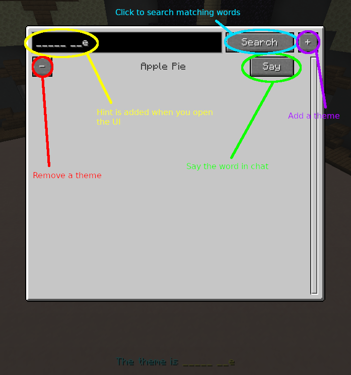

## What?

Helps you guess the theme by searching for words matching the hint given at the 90 second mark.

## How?

## Where?

Mod jar and theme list can be found in [Releases]().

## Who?

- List of themes by [oycyc](https://github.com/oycyc/GTB-Solver)
- UI library by [CottonMC](https://github.com/CottonMC/LibGui) : [MIT License](https://github.com/CottonMC/LibGui/blob/master/LICENSE)
- Json library by [google](https://github.com/google/gson) : [Apache License 2.0](https://github.com/google/gson/blob/main/LICENSE)